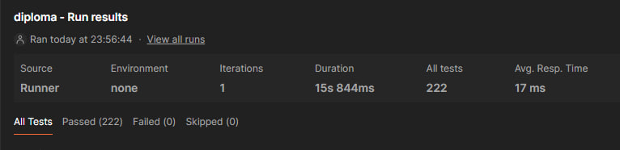

Находясь в папке infra, выполните команду docker-compose up. При выполнении этой команды контейнер frontend, описанный в docker-compose.yml, подготовит файлы, необходимые для работы фронтенд-приложения, а затем прекратит свою работу.

По адресу http://localhost изучите фронтенд веб-приложения, а по адресу http://localhost/api/docs/ — спецификацию API.

Привет, постман проходит 
вот скрин

Если ты не против я README напишу когда уже на сервер залью...потому что он точно поменяется
gg; yfgbie
q